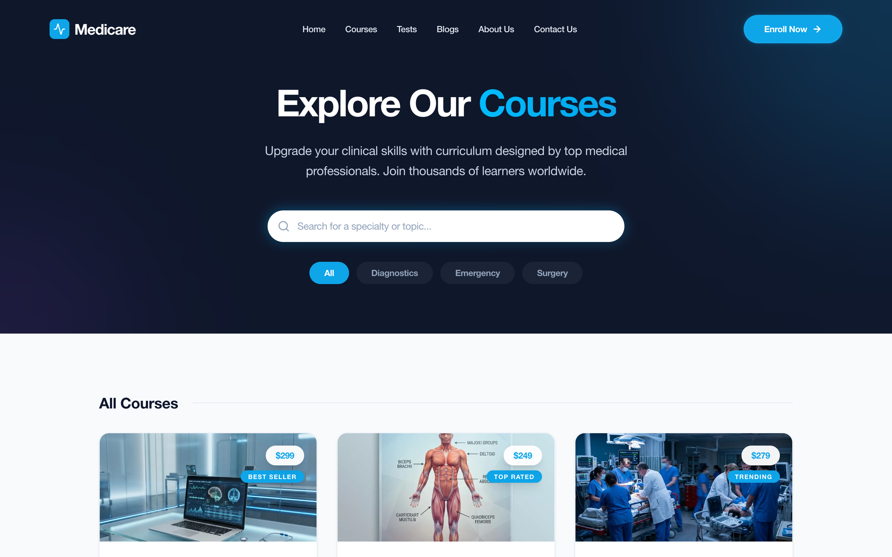
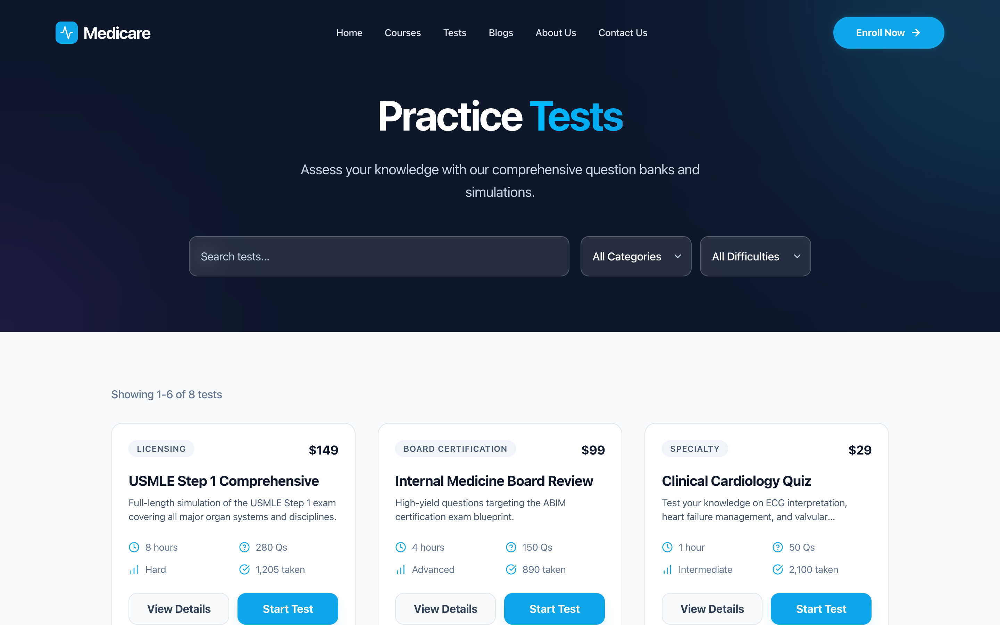
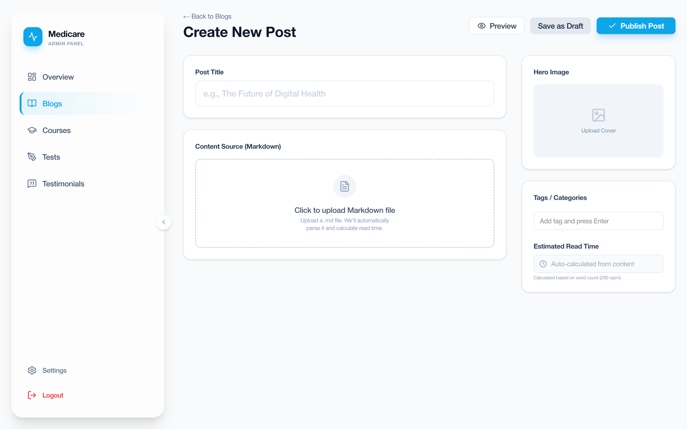

# Learn with Doc — Fully-Animated Medical-Education Platform

A **vibe-coded, production-grade product frontend** for a medical-education brand — built
spec-first with an AI pair, then hand-tuned for motion and polish. Not a landing page: a
**complete public site *and* a full admin CMS**, 37 components and 12 admin routes deep,
every surface animated. The point of the project is craft at speed — proving you can take a
brand from zero to a shippable, cohesive, motion-rich product in a single pass.

**Live:** [learn-with-doc.vercel.app](https://learn-with-doc.vercel.app) · admin at `/admin`

## Screenshots

 
 


1. **Landing** — animated hero, floating feature cards, social proof.
2. **Courses** — dark search hero, category filters, priced course catalog.
3. **Blogs** — featured article + tag system, TOC-driven reading experience.
4. **Practice Tests** — searchable test bank with category/difficulty filters.
5. **Admin CMS** — post editor: Markdown upload with auto read-time, hero upload, tags, publish/draft.

## What it is

"Expert Medical Education for Healthcare Pros" — a course/test/blog platform for doctors and
medical students. Two halves, both complete:

**Public site** — animated hero, featured courses, course & test catalogs with detail pages,
a full blog (table of contents, sticky/scroll CTAs, related cards), an about section
(mission, team, founder, journey, stats), and a contact flow. Scroll-progress bar, marquees,
carousels, FAQ, testimonials, marketing popup.

**Admin CMS** — 12 routes: create / edit / **live-preview** flows for courses, blogs, tests,
and testimonials, with an admin shell, sidebar, header, and delete-confirmation modals. The
whole site is content-driven, so the admin is the real control surface.

## Design & motion

Every section is deliberately animated (Framer Motion) — entrance transitions, a scroll
progress indicator, marquees, Swiper carousels, and Recharts data visualisations in the
admin. A single Tailwind design system carries a consistent brand across ~20 pages. The
"nice-frontend" bar — spacing rhythm, motion timing, component reuse — is the whole exercise.

## Stack

       

Content is JSON-driven (`src/data/*.json`) — no backend; the admin edits the same shape
the site renders.

## Run

```bash
pnpm install
pnpm dev        # http://localhost:3000  (admin at /admin)
```

## Layout

| Path | Role |
|---|---|
| `src/app/page.tsx` | animated landing page |
| `src/app/{courses,tests,blogs}/` | public catalogs + detail routes |
| `src/app/about` · `src/app/contact` | brand + contact surfaces |
| `src/app/admin/**` | 12-route CMS — create/edit/preview courses, blogs, tests, testimonials |
| `src/components/` | 37 UI components (public + `about/` + `admin/`) |
| `src/data/*.json` | the content model the whole app renders from |

> Built as a speed-and-craft exercise: brand → full product frontend → admin, in one pass.
